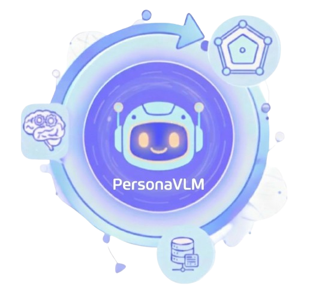
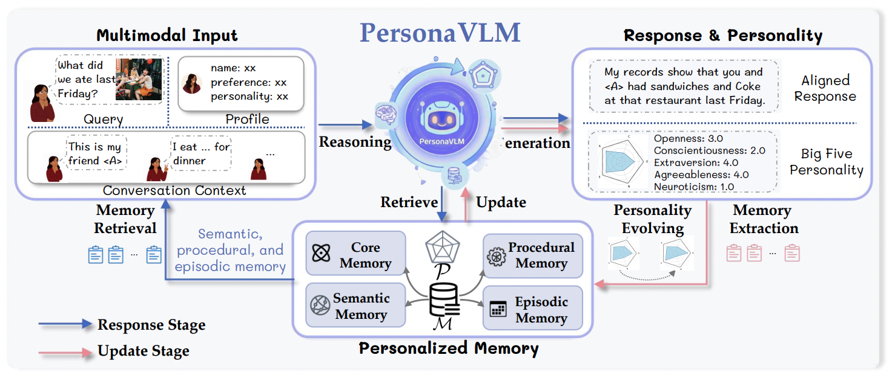
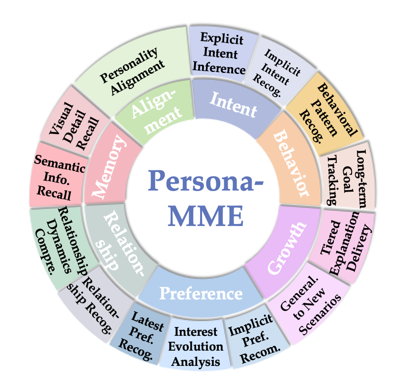
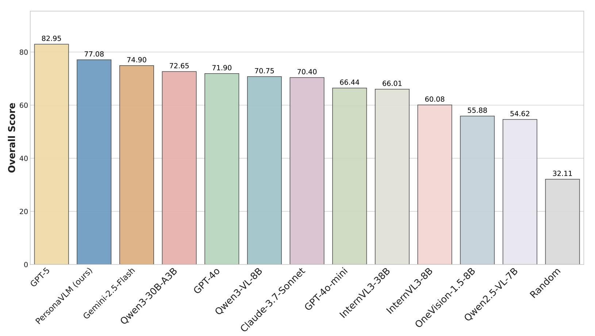
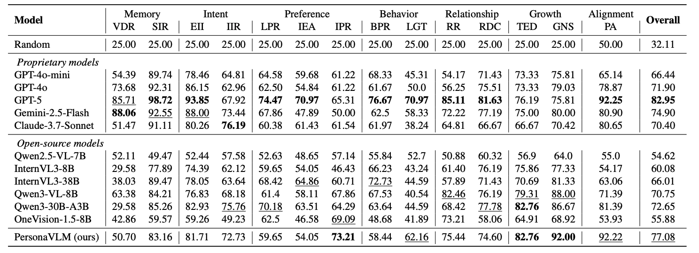
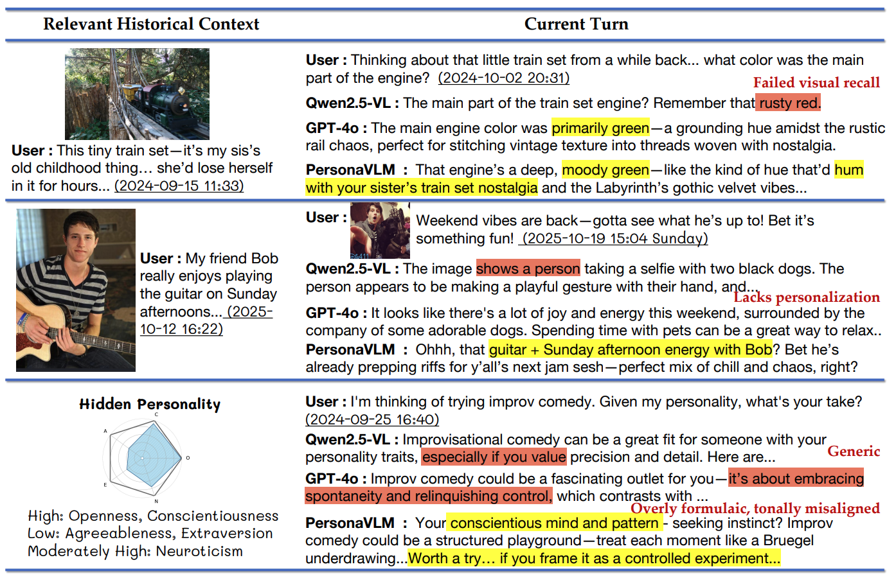
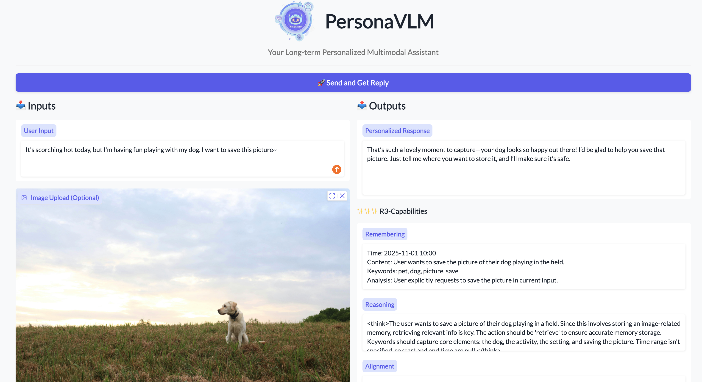

<p align="center">
  
</p>

<h1 align="center">PersonaVLM: Long-Term Personalized Multimodal LLMs</h1>

<p align="center">
    <a href="https://PersonaVLM.github.io"></a>
    <a href="http://arxiv.org/abs/2604.13074"></a>
    <a href="https://huggingface.co/ClareNie/PersonaVLM"></a>
    <a href="https://huggingface.co/datasets/ClareNie/Persona-MME"></a>
    <a href="https://huggingface.co/datasets/ClareNie/PersonaVLM-Dataset"></a>
</p>

Official implementation of **PersonaVLM**, an innovative personalized multimodal agent framework designed for long-term personalization.

---
## 📋 Table of Contents
- [🚀 News](#-news)
- [🌟 Overview](#-overview)
- [📊 Persona-MME Benchmark](#-Persona-mme-benchmark)
- [🚀 Performance](#-performance)
- [🚀 Quick Start](#-quick-start)
- [💻 Interactive Gradio Demo](#-interactive-gradio-demo)
- [✒️ Citation](#️-citation)
---

## 🚀 News
- **[2026.04]** 📢 **PersonaVLM officially Open-Sourced!** Model weights, training data, and the **Persona-MME** benchmark are now released!

---

## 🌟 Overview
<p align="center">
  
</p>

**PersonaVLM** transforms general-purpose MLLMs (e.g., Qwen2.5-VL) into personalized assistants capable of long-term interaction. It achieves this through a collaborative two-stage process featuring three core capabilities:

- **🧠 Remembering**: Proactively extracts and summarizes multimodal conversational histories into a structured, multi-type database (Core, Semantic, Episodic, and Procedural memories).
- **💡 Reasoning**: Conducts multi-turn reasoning by dynamically retrieving and integrating relevant long-term memories based on the conversation context.
- **🤝 Response Alignment**: Infers the user's latest latent traits using a **Momentum-based Personality Evolving Mechanism (PEM)**, ensuring generated responses are deeply aligned with the user's evolving characteristics.

---

## 📊 Persona-MME Benchmark
<p align="center">
  
  &nbsp; &nbsp; &nbsp;
  
</p>

To rigorously evaluate long-term personalization in multimodal settings, we establish **Persona-MME**, a comprehensive benchmark comprising over **2,000 curated interaction cases** designed to assess MLLMs across 14 fine-grained personalization tasks.

---

## 🚀 Performance
<p align="center">
  
</p>

Extensive experiments demonstrate that **PersonaVLM** significantly enhances a model's personalization capabilities and consistently outperforms strong counterparts, including proprietary models like GPT-4o and leading open-source alternatives. Under a 128k context setting, PersonaVLM achieves substantial improvements of **22.4% on Persona-MME** and **9.8% on PERSONAMEM**, surpassing GPT-4o by 5.2% and 2.0%, respectively.

<details>
<summary><b>🔍 Click to view Qualitative Examples</b></summary>
<p align="center" style="margin-top: 15px;">
  
</p>
</details>

---
## 🚀 Quick Start

### 1. Repository Structure
Before starting, ensure your project directory is organized as follows. The core reasoning and memory management logic is encapsulated within the `PersonaVLM/` module.

```text
PersonaVLM/
├── checkpoints/
│   ├── rl/                              # Download PersonaVLM weights here
│   ├── openai/clip-vit-base-patch32     # Local CLIP model
│   └── sentence-transformers/all-MiniLM-L6-v2 
├── data/
│   ├── Persona-MME/                         # Benchmark dataset for evaluation
│   └── training/                        # SFT and RL synthesized datasets
├── PersonaVLM/                               # Core PersonaVLM Agent Logic
│   ├── model.py
│   ├── PersonaVLMAgent.py
│   ├── prompts.py
│   ├── retriever.py
│   ├── tools.py
│   └── utils.py
├── train/                               # SFT and RL training scripts
├── eval.py                              # Evaluation script for Persona-MME
├── inference.py                         # CLI inference script
└── gradio_demo.py                       # Interactive Web UI
```

### 2. Environment Setup
Create a conda environment and install the required dependencies.
```bash
conda create -n PersonaVLM python=3.10 -y
conda activate PersonaVLM

pip install -r requirements.txt
```
> [!WARNING]
> Since PersonaVLM is built upon Qwen2.5-VL, it is strictly required to install `transformers==4.51.3` to prevent compatibility issues.

### 3. Prepare Models and Data
- **Model Weights**: Download the official [PersonaVLM Model](https://huggingface.co/ClareNie/PersonaVLM) and place it under `./checkpoints/rl`.
- **Retrieval Models**: Download CLIP and all-MiniLM-L6-v2 models to the `./checkpoints/` directory.
- **Datasets**: Download [Persona-MME](https://huggingface.co/datasets/ClareNie/Persona-MME) (for evaluation) and [PersonaVLM-Dataset](https://huggingface.co/datasets/ClareNie/PersonaVLM-Dataset) (for training) into `./data/`.

### 4. Inference
We provide a CLI script to chat with the PersonaVLM agent. It supports both standard reasoning and forced retrieval configurations:

```bash
python inference.py 
# Optional arguments:
# --force-retrieve   : Force the agent to execute memory retrieval for every message.
# --reasoning-mode   : Flag to toggle reasoning (default is True; passing this sets it to False).
```

### 5. Evaluation (Persona-MME)
To evaluate the model's long-term personalization capabilities on the Persona-MME benchmark:

```bash
python eval.py \
    --model_path ./checkpoints/rl \
    --bench_context 32k \
    --save_dir ./output/32k_Persona_MME_results
```

### 6. Training Pipeline
PersonaVLM is trained using a two-stage pipeline: Supervised Fine-Tuning (SFT) and Reinforcement Learning (RL).

#### Stage 1: Supervised Fine-Tuning (SFT)
*Note on Qwen2.5-VL*: The Qwen2.5-VL repository used for training does not support mixing pure-text and multimodal samples in a single batch. To resolve this, we append a dummy conversation to each text-only sample and mask the final interaction step during loss computation (Implementation details in `./train/sft/Qwen2.5-VL/qwen-vl-finetune/qwenvl/data/data_qwen.py`).

```bash
# 1. Regenerate data with dummy convs
python ./data/training/sft/regenerate.py

# 2. Launch SFT training
cd ./train/sft/Qwen2.5-VL/qwen-vl-finetune
CUDA_VISIBLE_DEVICES=0,1,2,3,4,5,6,7 sh scripts/sft_PersonaVLM.sh
```

#### Stage 2: Reinforcement Learning (GRPO)
Our RL stage is implemented based on the `ms-swift` framework. Key modifications for our custom reward design are located in `scripts/qwen_server.py` and `examples/train/grpo/plugin/plugin.py`.

Before starting RL, you must deploy the reward model (we use `Qwen3-30B-A3B-Instruct-2507`) via vLLM:

```bash
# 1. Deploy the Reward Model Server
MASTER_PORT=29501 CUDA_VISIBLE_DEVICES=6,7 python -m vllm.entrypoints.openai.api_server \
    --model /path/to/Qwen3-30B-A3B-Instruct-2507 \
    --tensor-parallel-size 2 \
    --host 0.0.0.0 \
    --port 8080 \
    --trust-remote-code \
    --gpu-memory-utilization 0.9

# (Optional) Test the reward server connection
python ./train/ms-swift-main/scripts/qwen_server.py

# 2. Launch RL Training
cd ./train/ms-swift-main
CUDA_VISIBLE_DEVICES=0,1,2,3,4,5 sh scripts/rl.sh
```

---

## 💻 Interactive Gradio Demo
We provide an interactive Gradio-based playground to explore the **"R3" process** (Proactive Remembering, Multi-step Reasoning, and Personality-based Response Alignment). The UI allows you to visualize the agent's internal cognitive steps.

<p align="center">
  
</p>

### Launch Locally
To start the demo, ensure your model weights are in `./checkpoints/rl` and run:

```bash
python gradio_demo.py
```
---

## ✒️ Citation
If you find our work helpful, please cite:
```latex
@inproceedings{nie2026personavlm,
  title={PersonaVLM: Long-Term Personalized Multimodal LLMs},
  author={Nie, Chang and Fu, Chaoyou and Zhang, Yifan and Yang, Haihua and Shan, Caifeng},
  booktitle={Proceedings of the IEEE/CVF Conference on Computer Vision and Pattern Recognition (CVPR)},
  year={2026},
  url={http://arxiv.org/abs/2604.13074}
}